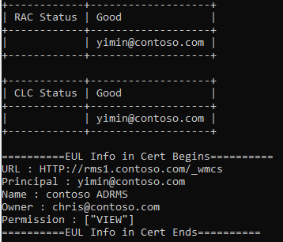
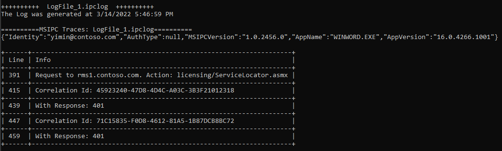
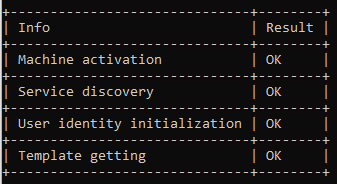
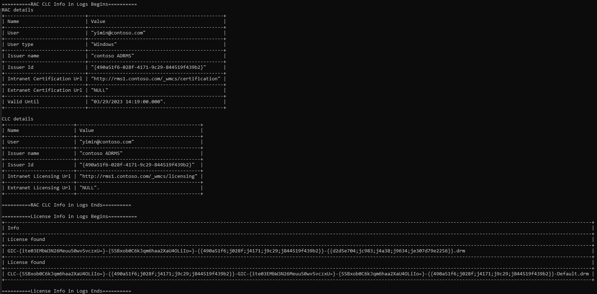
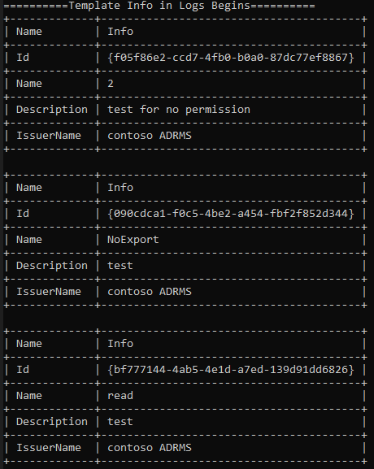
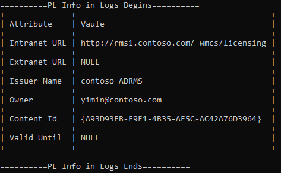
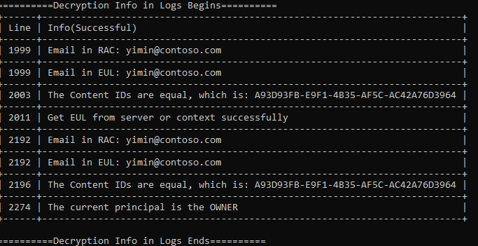

# Log Analyzer for AIP/RMS
This repository is for a tool to analyze AIP/RMS related logs. It helps with the process of decryption/encryption analysis and understanding the communication between RMS server and client machine under different troubleshooting scenarios.

For RMS theory we recommend visiting our official document: [How does Azure RMS work? Under the hood](https://docs.microsoft.com/en-us/azure/information-protection/how-does-it-work).

## Getting started
Run the tool by double click **SmallTool.exe**. Input the log file path and we could get the analysis report.

This tool uses **rules.json** file to define the requirements:
```json
{
   "LogOnly":true,
   "LogAnalyse":true,
   
   "ResponseType":"exclude",
   "Mode":2,
   "ResponseCodeList":[
   "200","401"
   ],
    
   "LogFileOrderBy":2,
   "CertAnalyse":false,
   "CertRules":{
      "RAC":[
         "<URL>/XrML/BODY/ISSUER/OBJECT/ADDRESS</URL>",
         "<Principal>/XrML/BODY/ISSUEDPRINCIPALS/PRINCIPAL/OBJECT/NAME</Principal>",
         "<Name>/XrML/BODY/ISSUER/OBJECT/NAME</Name>"
      ],
      "CLC":[
         "<URL>/XrML/BODY/ISSUER/OBJECT/ADDRESS</URL>",
         "<Principal>/XrML/BODY/ISSUEDPRINCIPALS/PRINCIPAL/OBJECT/NAME</Principal>",
         "<Name>/XrML/BODY/ISSUER/OBJECT/NAME</Name>"
      ],
	  "EUL":[
         "<URL>/XrML/BODY/ISSUER/OBJECT/ADDRESS</URL>",
         "<Principal>/XrML/BODY/ISSUEDPRINCIPALS/PRINCIPAL/OBJECT/NAME</Principal>",
         "<Name>/XrML/BODY/ISSUER/OBJECT/NAME</Name>",
		 "<Owner>/XrML/BODY/WORK/METADATA/OWNER/OBJECT/NAME</Owner>",
		 "<Permission>/XrML/BODY/WORK/RIGHTSGROUP/RIGHTSLIST</Permission>"
      ]
   }
}
```

 -  LogFileOrderBy：

   1: Time order

   2: Time desc order

 - LogOnly:

   true: This mode will focus on Logs folder only, no certificate analysis will be included in report. Input the folder path of Logs or a single *.ipclog file.

   false: This mode will focus on the whole MSIPC folder. Input the MSIPC folder path.

 - LogAnalyse:

   true: Use this tool to analyze logs in MSIPC folder.

   false: Exclude log analysis.

 - CertAnalyse:

   true: Use this tool to analyze certificates in MSIPC folder.

   false: Exclude certificate analysis.

 - Mode:

   1: Encryption

   2: Decryption

   3: Both encryption and decryption analysis
   
   4: Only log trace analysis

 - ResponseType:

   "include" or "exclude".

 - ResponseCodeList:

   Define which requests will be include/exclude in report details by their http status code.

## Report Details

### License/Certificate info in MSIPC folder
If "CertAnalyse" is enabled, we could get certificate and license information from MSIPC folder:


For more information about RMS Licenses and Certificates: [Licenses and Certificates](https://techcommunity.microsoft.com/t5/security-compliance-and-identity/licenses-and-certificates-and-how-ad-rms-protects-and-consumes/ba-p/247309)

### Request/Response info in MSIPC Logs folder

From Log files, we could get the request URLs sending from client and response code getting from server. It helps us quickly narrow down the issue. (  access deny with multi-accounts; server issue in AD RMS scenario, etc.)

The log generation time will show at the top and we could **sort all log files by time/time desc** in rule settings.



### Bootstrap analysis

This module analyzes the process of bootstrap, including machine activation, service discovery, user identity initialization and templates downloading. If we detect some key words indicating issues, the Result will be "May fail/skip"



### File encrypt info

For encryption mode, we could get certificate and license information from the log file. More importantly, the templates' information which is from RMS server.



Template is used to protect documents. From log files, all templates which are published to the user could be received from RMS server and basic information has been logged.



### File decrypt info

For decryption mode, we focus on PublishLicense which is from protected file itself, and EndUserLicense which is the license to open encrypted files.

From PL, we could determine the owner of this file and which URL will be visiting to get EUL.



We show the checking process and how we get EUL in decryption report. 




## Contributing

All the code for this Log Analyzer is available on GitHub. We will gladly accept contributions for the service, different modules, and the documentation.

